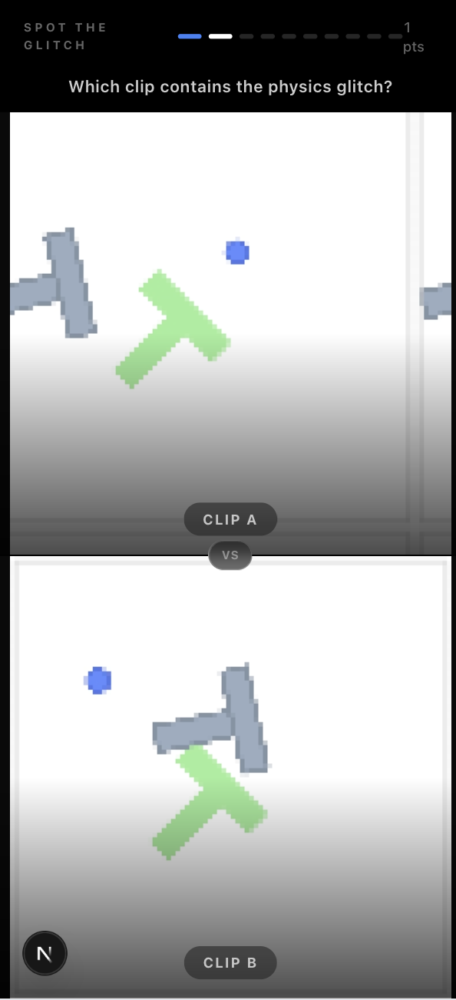
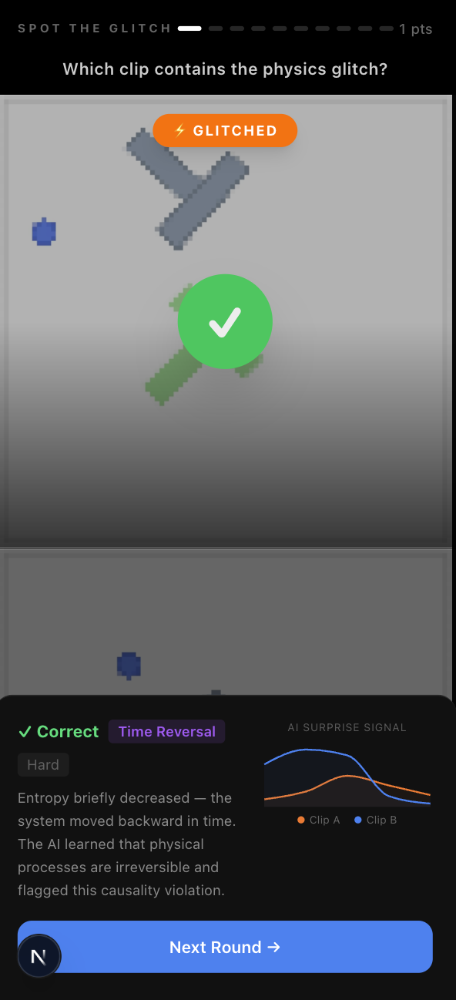
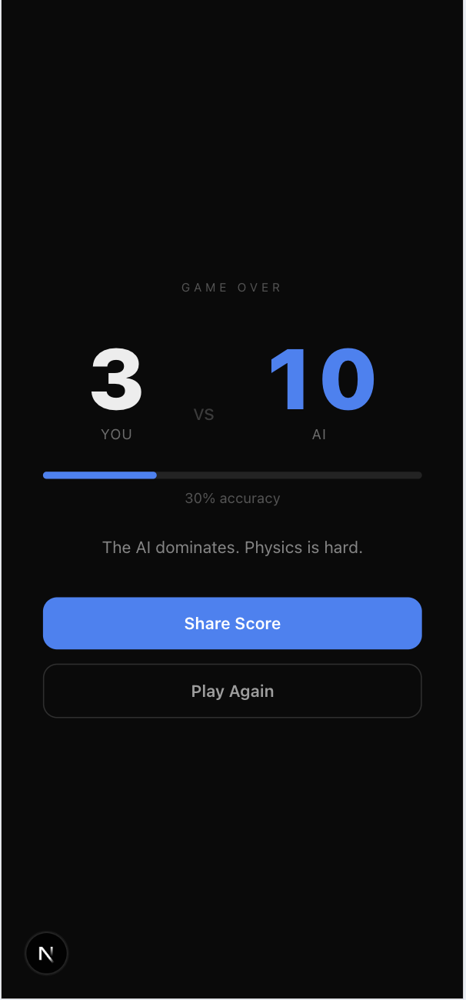

# Spot the Glitch

> Can you beat an AI that learned physics from scratch?

A web game where you watch pairs of 3-second clips and spot the one with a physics violation. After 10 rounds, see how your intuition compares to an AI world model that scores 10/10 every time.

Built on top of [LeWM](https://github.com/lucas-maes/le-wm) — a latent-space world model trained on robotic manipulation data that learns the laws of physics purely from observation.

<p align="center">
  
  &nbsp;&nbsp;
  
  &nbsp;&nbsp;
  
</p>

## How it works

1. **Watch** two looping 3-second clips side by side
2. **Tap** the one you think has a physics violation (teleportation, time reversal…)
3. **See** what the AI detected — a chart of its surprise signal over time, and a plain-English explanation of the glitch
4. **Compare** your final score to the AI's perfect 10/10

### The AI

The game uses [LeWM](https://github.com/lucas-maes/le-wm) ([arXiv:2603.19312](https://arxiv.org/abs/2603.19312)), a JEPA-style latent world model trained on [PushT](https://github.com/huggingface/gym-pusht) trajectories. It learns to predict future frame embeddings from past ones. When a clip violates physics, the model's prediction error — its **surprise signal** — spikes. That spike is what you see in the chart after each round.

Glitch families in this dataset:

| Type | What happens |
|---|---|
| **Teleportation** | Object jumps position instantaneously — conservation of momentum violated |
| **Time Reversal** | Entropy decreases; the system moves backward in time |
| **Gotcha** | No glitch — both clips are normal; tests whether you over-pattern-match |

## Getting started

```bash
bun install
bun dev
```

Open [http://localhost:3000](http://localhost:3000).

To regenerate the quiz data from a fresh LeWM checkpoint, see [`scripts/README.md`](scripts/README.md).

## Stack

- **Next.js 16** (App Router, Turbopack) + TypeScript strict
- **Tailwind CSS v4** + Framer Motion
- **Recharts** for the surprise signal chart
- **Bun** as package manager and runtime
- [Feature-Sliced Design](https://feature-sliced.design/) architecture

## License

[MIT](./LICENSE)
